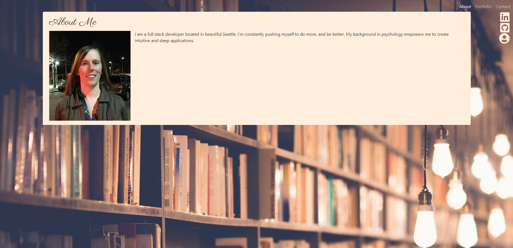

# React Portfolio  

## Description
    This my hideous portfolio that will get majorly reworked the second I finish project 3.

  
  ## Table of Contents
  1. [Installation](#Installation)
  2. [Usage](#Usage)
  3. [Tests](#Tests)
  4. [GitHub Links](#GitHubLinks)

  ## Installation
  
    NPM install will install all the needed dependencies.
  
  ## Usage

    The site is deployed.
  
  ## Tests
  
    npm tests. No Tests provided.
   
  ## GitHubLinks
  
  [Git Hub Username](https://www.github.com/CodySamuels)
  
  [The Repo](https://github.com/CodySamuels/react-portfolio)

  [The Deployed Link](https://csam-react-portfolio.herokuapp.com/)